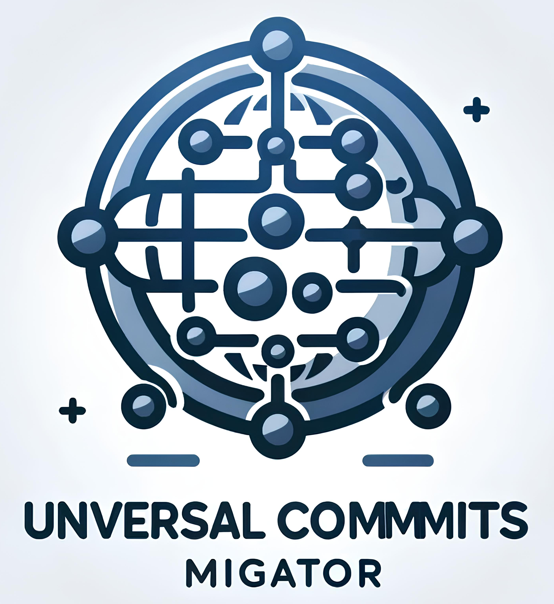

<link rel="stylesheet" href="docs/assets/css/style.scss" />

<figure>
  
  <figcaption class="image-caption">Logo generated by an AI tool.</figcaption>
</figure>

# Universal Commits Migrator (UCM)

This tool is designed to migrate your commit history from source control management platforms like GitLab or Bitbucket to a private/public GitHub repository as empty commits. This utility allows you to maintain a record of your contributions and showcase them on your GitHub profile, all while ensuring the actual code or changes from the commits are not transferred, only the commit metadata (such as timestamps) are preserved.

⭐ Don't forget to give the project a star! Thanks again! ⭐

This tool will transform your GitHub contribution chart like the following:

<figure>
  
  <figcaption class="image-caption">GitHub Contribution Chart Transformation</figcaption>
</figure>

## Features

- **Multiple Source Support**: Retrieve your commit history from various source control providers like GitLab or Bitbucket.
- **Create Empty Commits**: Push empty commits to a designated GitHub repository with the original commit timestamps, allowing you to visualize your contribution activity on GitHub.
- **Incremental Updates**: Only new commits since the last run are pushed, avoiding duplicates and saving time.
- **Log Output**: Detailed logs for each operation, making it easy to track and troubleshoot the process.
- **Extensible Architecture**: Easily extend the tool to support more source control providers as needed.

## Getting Started

These instructions will guide you through the setup and execution of the Universal Commits Migrator (UCM) on your local machine.

### Prerequisites

- Source Control Management Personal Access Token: Token to fetch commit data from your account (GitLab, Bitbucket, etc.).
- GitHub Personal Access Token: Token with `repo` scope to push commits to your GitHub repository. [Create one here](https://github.com/settings/tokens).
  - I recommend when creating this token to give it only access to your repo.
- A GitHub repo to push the commits to, I recommend when creating a repo to push a first commit with a ReadMe file just put there your repo name or whatever you want.
  - For me, I called it `commits-history-records` and a readme file with just this words in it.

### Installation

1. **Clone the Repository**: Clone this repository to your local machine using:

   ```bash
   git clone https://github.com/AhmedRaafat14/universal-commits-migrator.git
   ```

2. **Navigate to the Project Directory**:

   ```bash
   cd universal-commits-migrator
   ```

3. **Configure Environment Variables**: Rename the provided `.env.example` to `.env` and fill in your details:

   ```plaintext
   # GitLab Configuration
   GITLAB_API_URL=https://gitlab.yourdomain.io/api/v4
   CONTRIBUTED_PROJECTS=123,456 # Optional: Specify project IDs to fetch commits from, separated by commas.
   GITLAB_TOKEN=your_gitlab_token

   # GitHub Configuration
   GITHUB_API_URL=https://api.github.com/repos/your_username/your_repo
   GITHUB_API_VERSION=2022-11-28
   GITHUB_BRANCH_TO_COMMIT_TO=master # Default is master; change if needed.
   GITHUB_USERNAME=your_github_username
   GITHUB_EMAIL=your_email@domain.com
   GITHUB_TOKEN=your_github_token
   
   # Tool sources and destinations
   SOURCE=gitlab # Default is gitlab; change if needed.
   DESTINATION=github # Default is github; change if needed.
   ```

4. **Install Dependencies** (if the project has any, e.g., external Go modules):

   ```bash
   go mod tidy
   ```

### Usage

Run the main script to start the migration process:

```bash
go run main.go
```

The script will perform the following actions:

1. **Determine Source & Destination**: The script will read the environment variables to determine the source (GitLab, Bitbucket, etc.) and destination (GitHub) for migration.
2. **Fetch Commits from GitLab**: The script will connect to GitLab using the provided API token and fetch your commit history.
3. **Process Commits**: Each commit's date is checked against the `pushed_commits.txt` file to determine if it has already been migrated.
4. **Push Empty Commits to GitHub**: For each new commit, an empty commit with the same timestamp is created and pushed to the specified GitHub repository.
5. **Update `pushed_commits.txt`**: After a commit is successfully pushed to GitHub, its date is recorded in the `pushed_commits.txt` file to avoid reprocessing in future runs.

### Logs

The output and logs are printed on a file called `app.log`, where you can track the progress and troubleshoot if needed.

### Notes

- **Privacy**: The actual content of your commits (code changes, etc.) is not transferred to GitHub, ensuring your private work remains confidential.
- **Incremental Updates**: The tool is designed to be idempotent, meaning you can run it multiple times without duplicating commits in your GitHub repository.

### Contributions

Contributions are welcome! If you have suggestions for improvements or encounter any issues, please feel free to open an issue or submit a pull request.

Check out our [contribution guide](contribution.md) for more information on how to contribute to this project.

### License

This project is licensed under the [MIT License](LICENSE.md).

---

Thank you for using the Universal Commits Migrator (UCM)! We hope this tool helps you showcase your GitLab contributions on your GitHub profile effectively.